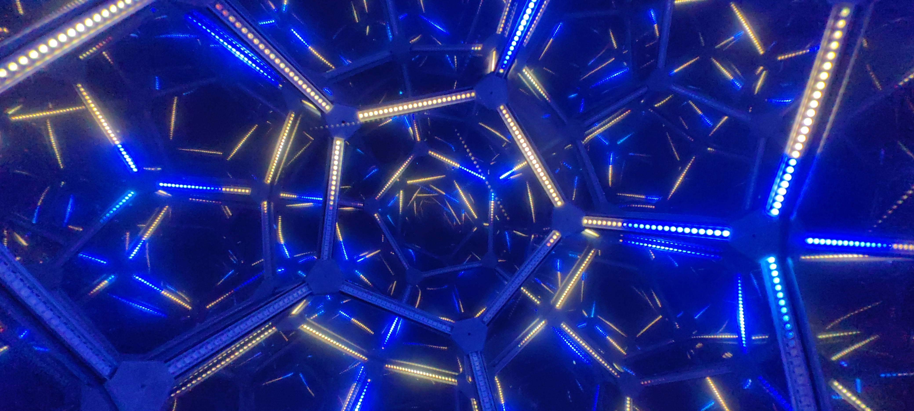
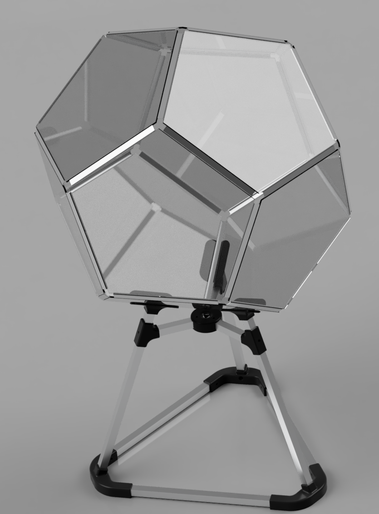

# Infinity Polyhedra

This repository contains the files, notes, and software related to building an infinity dodecahedron. The project is built around an STM32F401 microcontroller and a custom Python desktop application. While designed for a dodecahedron, the core logic is intended to be flexible enough for other polyhedral geometries.

> *This is a personal project and a work-in-progress.*

  

> [!INFO]
> This is a complex project that requires some familiarity with Python and STM32CubeIDE. Unless you are simply replicating the build process with the same components, this will likely not be a "download and run" solution.

## Table of Contents

*   [Features](#features)
*   [Hardware](#hardware)
*   [Software](#software)
*   [Design Files](#design-files)
*   [Technical Notes & How It Works](#technical-notes--how-it-works)

## Features

*   **High-Framerate Animations:** The firmware uses a multi-SPI DMA approach to drive a large number of LEDs smoothly, achieving highframe rates.
*   **Geometry-Aware Logic:** The firmware includes a geometric core that can, in theory, be adapted for various polyhedra.
*   **Interactive Edge Remapping:** The app provides a debug mode for remapping physical LED strips to their correct logical edges on the 3D model. This allows for 'vibe wirering'.
*   **PS4 Controller Interface:** The desktop app is built around the use of a PS4 controller, which is the primary method for sending commands to the microcontroller to switch animation modes and operate the remapping interface.

## Hardware

This section covers the physical build of the dodecahedron, including the electronics, materials, and construction notes from my experience.

![PLACEHOLDER: Photo of the fully assembled and lit dodecahedron]

### Electronics

*   **Microcontroller:** STM32F401.
*   **LED Strips:** WS2812B-style addressable LEDs. High-density strips (e.g., 144/m) are recommended. *(1515 300/m are of course better if your pockets allow it)*
*   **Power:** `TODO: HOW MANY PIXIES`

`TODO: Wirering, .4mm enameled and regular corner wired`

### Frame and Panels

*   **Frame:** The dodecahedron frame is built from LED extrusions. (15mm x 10mm)
*   **Panels:** 4mm acrylic panels. i recommend some 3mm foam tape to light seal the edges.
*   **Mirror Film:** The infinity effect is created with one-way mirror foil. The cheapest foil from AliExpress was surprisingly effective, but higher quality film is recommended.
    > **Note on Brightness:** The LEDs can be overwhelmingly bright. Consider using a mirror film/tint 90%+ (e.g., stacking two layers of 80% film) to trade in brightness for reflections.

### Stand

The stand is built from fairly regular aluminum extrusions. (15mm x 15mm) and assembled with some 3D printed parts and M4 black oxide button head screws.  
The files include a small box which gets hooked onto it containing the powersupply and black pill.

## Software

The software is split into two main components: the Python desktop application for control and the C firmware for the STM32 microcontroller.

### Desktop Application (Python)

A PyQt5 application that provides a 3D visualization of the polyhedron for debugging and serves as the primary command interface while sorting the edges and testing animations.

`TODO screenshot`

#### Setup & Running the App

1.  **Controller:** A PS4 controller is not required but highly recommended for interaction. *(with that i recommend [DS4Windows](https://ds4-windows.com/))* Altho any controller would work, or just a keyboard.
2. `TODO: link to serial driver STM32 USB thingy`
3.  **Setup (Windows):** `start_app.bat` to automatically create venv with all necessary dependencies from `requirements.txt`.

The stm32 should automatically connect via serial, and so should your controller with pygame.

### Firmware (STM32)

Provided is a STM32CubeIDE project meant for the STM32F401CCU that drives 720 WS2812B LEDs spread across 3 SPI busses with DMA

Key parameters can be tuned in `config.h`.

## Design Files

inside of the models folder there currently is the full step model, and the old joints as a future design refrence.

> **Note:** i lost the CAD files of the connector pieces, you shouldnt use them anyways, they are bad. i got them working with a heated insert in the bottom and a single screw, but if i had to do it again i would make sure that the leds lay inside, ie the importance of a contious light strip is greater than the best viewport.

### Technical Notes

The `polyhedron.c` file in the firmware includes functions for basic geometric operations like truncation... A rhombitruncated icosidodecahedron is technically possible to generate but not with the current way we are creating/handling them. For more complex shapes, it would be better to use an external library or mesh program to generate the vertex data and hardcode it. (or help make the poly creation more compliant)

